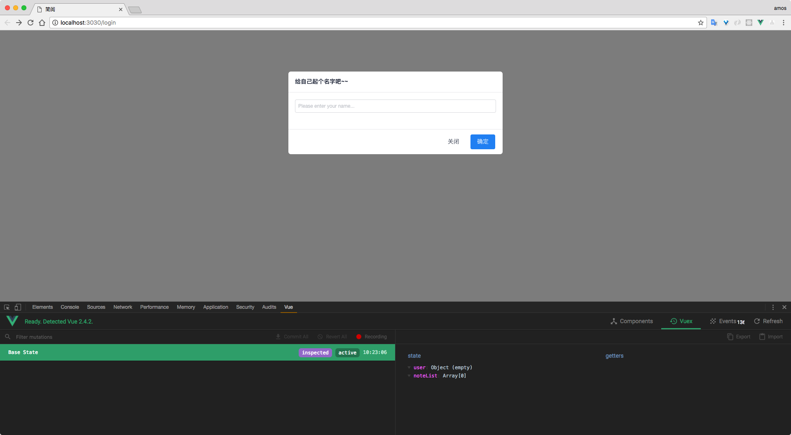
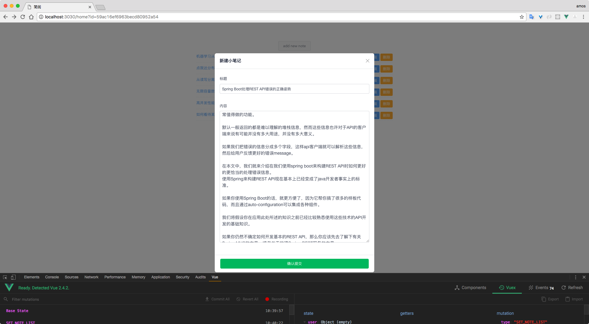
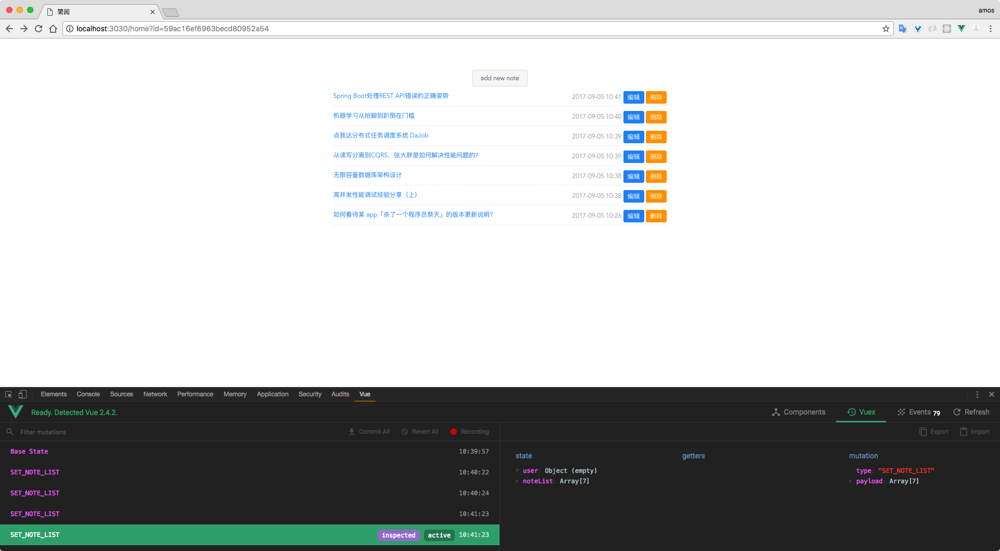
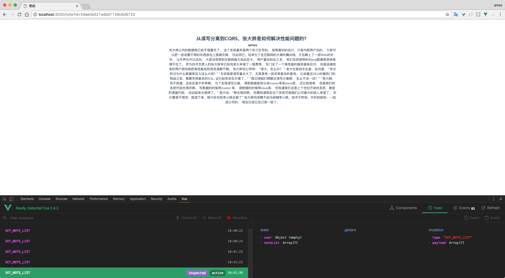

# vue-express-simple

> vue全家桶和express的交互和后端的一些模型创建及套路性的接口编码

# 前言

对前后端交互的真实场景的展示，虽然场景很简单，但是其基本涵盖了当前常用的技术栈。

对学习vue或者express的同学的一点指向，主要是实践，很快就能理解。

__注意: 项目虽小，五脏俱全。😆😆__

## 技术栈

vue2 + vuex + vue-router + webpack + ES6 + express + mongo


## 项目运行

```
git clone https://github.com/dreamsk/vue-express-simple.git

cd vue-express-simple

npm i or yarn

npm run dev (前端)  localhost:3030

npm start (后端)  localhost:3000

```


# 说明

>  如果对您有帮助，您可以点右上角 "Star" 支持一下 谢谢！ ^_^

>  开发环境 macOS 10.12.6  Chrome 60  nodejs 8.2.1

>  如有问题请直接在 Issues 中提，或者您发现问题并有比较好的规划，欢迎 PR 👍

# 效果截图

首页


新增页


编辑、删除、列表页


详情页


# 项目布局

```
├── build                             // webpack配置文件
├── config                            // 项目打包路径
├── screenshots                       // 效果截图
├── client                            // 前端源码目录
│   ├── components                    // 组件
│   │   ├── Home.vue                  // 首页组件
│   │   ├── Login.vue                 // 登录组件
│   │   └── Note.vue                  // note详情组件
│   ├── router                        // 路由配置
│   │   └── index.js                  // 路由入口
│   └── store                         // vuex的状态管理
│   │   ├── action.js                 // 配置actions
│   │   ├── index.js                  // 引用vuex，创建store
│   │   ├── mutation-types.js         // 定义常量muations名
│   │   └── mutations.js              // 配置mutations
│   ├── App.vue                       // 页面入口文件
│   └── main.js                       // 前端程序入口文件
├── server                            // 后端源码目录
│   ├── bl 		                      // 请求响应
│   │   ├── user.js                   // 用户相关请求 
│   │   └── note.js                   // note相关请求
│   ├── dal                           // 与mongo的crul操作
│   │   ├── userDal.js                // 用户查询操作
│   │   └── noteDal.js                // note的增删改操作
│   │── models                        // 数据模型
│   │   ├── user.js                   // 用户模型 
│   │   ├── note.js                   // note模型
│   │   └── index.js                  // 模型入口
│   ├── config.js                     // 后端配置文件
│   │── index.js                      // 后端主文件
│   └── router.js                     // 后端路由
├── app.js                 		      // 后端入口
├── package.json			          // package.json
└── index.html              		  // 入口html文件

```